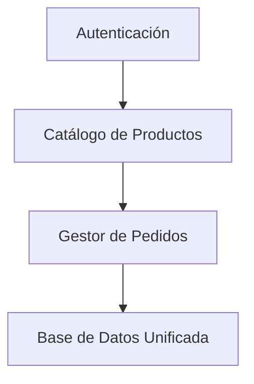
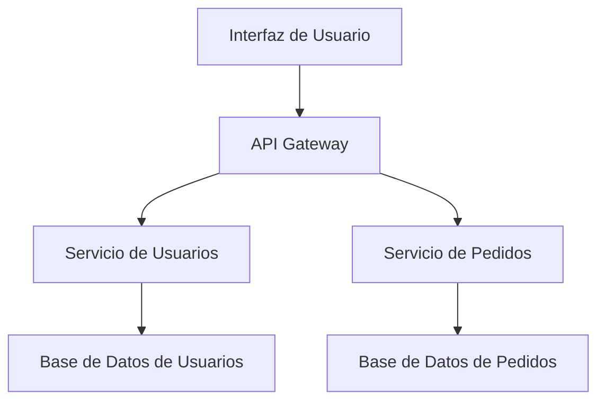
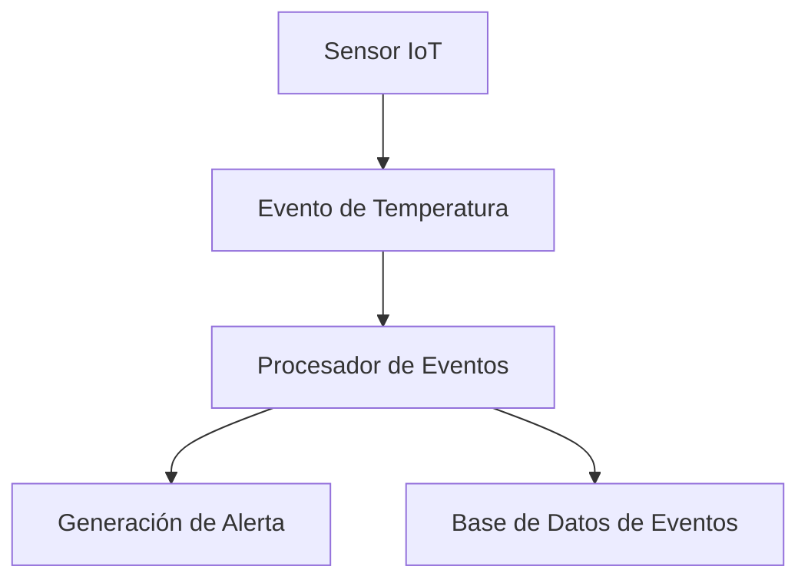
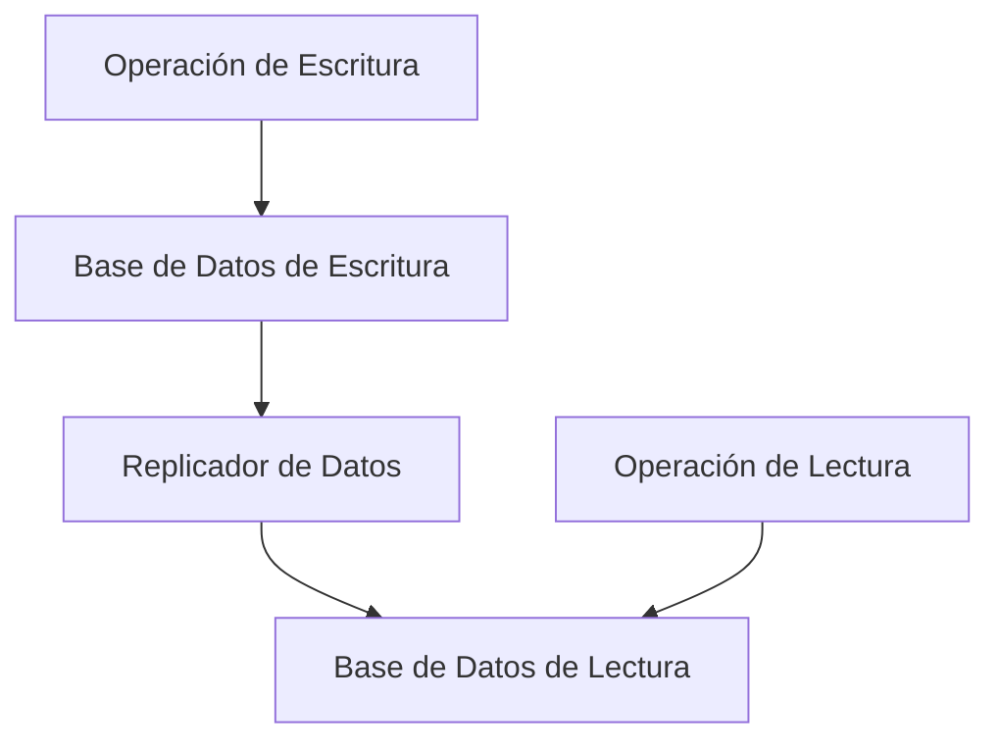
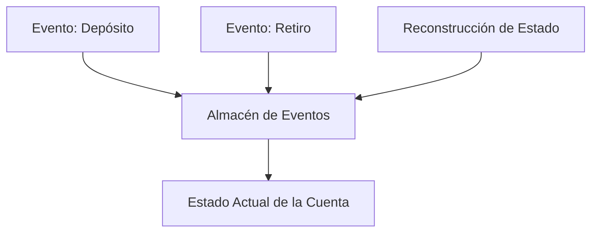

### Patrones de Arquitectura

#### **Introducción**
Los patrones de arquitectura proporcionan soluciones probadas para problemas recurrentes en el diseño de sistemas. Estos patrones permiten estandarizar las decisiones arquitectónicas, promoviendo sistemas escalables, resilientes y mantenibles. Este documento presenta una introducción detallada a los patrones clásicos y avanzados, con ejemplos prácticos y consideraciones clave para su implementación en sistemas reales.

---

### **1. Patrones Clásicos**

#### **1.1 Monolito Modular**
- **Descripción:**
  - Una aplicación monolítica organiza el código en módulos bien definidos dentro de una base de código única.
- **Ventajas:**
  - Simplicidad de despliegue.
  - Fácil de desarrollar en etapas iniciales.
- **Desventajas:**
  - Dificultad para escalar horizontalmente.
  - Problemas de aislamiento al realizar cambios.

**Caso Práctico:**
Una pequeña tienda en línea implementa un monolito modular para gestionar catálogo, usuarios y pagos. Cada funcionalidad está claramente separada en módulos dentro del mismo proyecto, lo que permite su rápida implementación y mantenimiento inicial. Sin embargo, a medida que el negocio crece, se enfrentan a desafíos de escalabilidad que obligan a considerar un rediseño.

**Diagrama Representativo:**

---

#### **1.2 Microservicios**
- **Descripción:**
  - Se divide la aplicación en servicios pequeños, cada uno con su propia responsabilidad y base de datos.
- **Ventajas:**
  - Escalabilidad independiente.
  - Despliegues rápidos y flexibles.
- **Desventajas:**
  - Mayor complejidad en la comunicación.
  - Necesidad de herramientas adicionales para orquestación y monitoreo.

**Caso Práctico:**
Un sistema de gestión de pedidos utiliza microservicios para manejar pagos, inventario y envíos. Cada servicio se escala de forma independiente según la carga. Por ejemplo, durante eventos promocionales, el servicio de pagos puede escalar horizontalmente para manejar transacciones adicionales sin afectar el rendimiento del resto del sistema.

**Diagrama de Ejemplo:**

---

#### **1.3 Event-Driven Architecture (EDA)**
- **Descripción:**
  - Los componentes del sistema interactúan mediante eventos, desacoplando la lógica de negocio y mejorando la escalabilidad.
- **Ventajas:**
  - Respuesta en tiempo real.
  - Alta tolerancia a fallos.
- **Desventajas:**
  - Complejidad en la gestión de eventos.
  - Dificultad para garantizar consistencia.

**Caso Práctico:**
Una aplicación de IoT recopila datos de sensores en tiempo real. Por ejemplo, sensores de temperatura en una planta industrial envían eventos cada vez que se detecta una anormalidad. Un sistema orientado a eventos procesa estos datos y genera alertas automáticas para los operadores, garantizando una rápida respuesta.

**Diagrama Representativo:**

---

### **2. Patrones Avanzados**

#### **2.1 CQRS (Command Query Responsibility Segregation)**
- **Descripción:**
  - Separa las operaciones de escritura (Command) y lectura (Query) en el sistema.
- **Ventajas:**
  - Optimiza el rendimiento de consultas.
  - Facilita la escalabilidad.
- **Desventajas:**
  - Incremento en la complejidad.

**Caso Práctico:**
Un sistema de comercio electrónico utiliza CQRS para gestionar pedidos. Las operaciones de escritura (crear o actualizar pedidos) se procesan en una base de datos optimizada para transacciones, mientras que las consultas de catálogos se manejan en una base de datos replicada optimizada para lecturas rápidas. Esto asegura que las consultas de usuarios no ralenticen el procesamiento de pedidos.

**Diagrama Representativo:**

---

#### **2.2 Event Sourcing**
- **Descripción:**
  - Registra todos los cambios de estado como una secuencia de eventos, permitiendo reconstruir el estado actual.
- **Ventajas:**
  - Historial completo de cambios.
  - Alta consistencia con CQRS.
- **Desventajas:**
  - Almacenamiento y gestión de grandes volúmenes de eventos.

**Caso Práctico:**
Un sistema bancario utiliza Event Sourcing para registrar todas las transacciones. Cada depósito, retiro o transferencia se almacena como un evento independiente. Esto permite reconstruir el saldo de cualquier cuenta en cualquier punto del tiempo, facilitando auditorías y resolviendo disputas.

**Diagrama Representativo:**

---

### **3. Comparación de Patrones**
| Patrón              | Ventajas                          | Desventajas                      | Uso Común                     |
|---------------------|-----------------------------------|----------------------------------|---------------------------------|
| Monolito Modular   | Simplicidad inicial               | Difícil de escalar              | Aplicaciones pequeñas         |
| Microservicios      | Escalabilidad independiente       | Complejidad en la comunicación  | Sistemas distribuidos          |
| Event-Driven       | Respuesta en tiempo real          | Complejidad en la gestión       | IoT, notificaciones            |
| CQRS               | Rendimiento optimizado            | Mayor complejidad               | Comercio electrónico          |
| Event Sourcing     | Historial completo de eventos     | Almacenamiento intensivo        | Auditorías, banca             |

---

### **4. Ejercicios Prácticos**
1. Diseñar un sistema utilizando Microservicios para una aplicación de reservas de hotel. Identificar los servicios independientes y sus interacciones.
2. Implementar un modelo CQRS en un sistema de gestión de pedidos. Simular la separación de comandos y consultas en bases de datos diferentes.
3. Crear un diagrama para una arquitectura orientada a eventos en un sistema de monitoreo de sensores IoT, definiendo cómo los eventos fluyen entre productores y consumidores.
4. Comparar los beneficios de un monolito modular frente a microservicios en una aplicación que experimenta crecimiento exponencial en usuarios y datos.

---

### **Referencias y Recursos**
1. "Building Microservices" - Sam Newman.
2. [Martin Fowler: Microservices](https://martinfowler.com/microservices/).
3. [Event-Driven Architecture en AWS](https://aws.amazon.com/event-driven-architecture/).
4. [CQRS and Event Sourcing](https://microservices.io/patterns/data/cqrs.html).
5. [Documentación de Kafka](https://kafka.apache.org/documentation/).

---

Este documento proporciona una introducción clara a los patrones de arquitectura más comunes, incluyendo ejemplos, ejercicios prácticos y recomendaciones para aplicarlos en proyectos reales.

