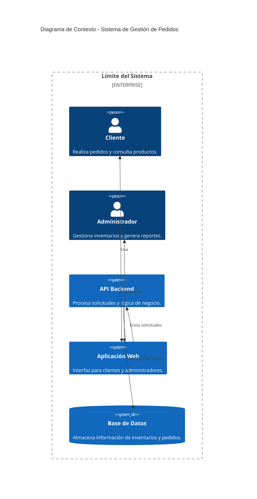

### Fase 2: Diseño de Arquitectura

#### **Objetivo:**
Diseñar la arquitectura del sistema usando **Clean Architecture**, el modelo **C4**, y decisiones técnicas fundamentadas en los requisitos funcionales y no funcionales del sistema.

---

#### **Paso a Paso:**

1. **Definir el Problema:**
   - La gestión actual de pedidos es manual, causando errores y retrasos.
   - Se necesita un sistema robusto, escalable y modular para manejar pedidos en tiempo real.

2. **Requerimientos Funcionales:**
   - CRUD de pedidos.
   - Gestión de usuarios (clientes y administradores).
   - Generación de reportes.

3. **Requerimientos No Funcionales:**
   - **Disponibilidad:** 99.9% SLA.
   - **Escalabilidad:** Soporte para 1000 RPS (requests per second).
   - **Latencia:** Respuesta promedio menor a 200ms.
   - **Seguridad:** Autenticación basada en JWT y gestión de secretos con Vault.

4. **Decisiones Técnicas:**
   - **Arquitectura:** Clean Architecture para desacoplar reglas de negocio, lógica de aplicación e infraestructura.
   - **Modelo de Despliegue:** Kubernetes con Helm Charts para configuraciones dinámicas y GitOps con ArgoCD.
   - **Base de Datos:** PostgreSQL con replicación para soportar CQRS.
   - **CI/CD:** GitHub Actions con validación automatizada.
   - **Monitoreo:** Prometheus y Grafana para métricas y alertas.

5. **Diagrama de Contexto (Nivel 1 - C4):**
   - Identificar actores principales: Cliente, Administrador, API Backend.
   - Representar interacciones generales.

6. **Dividir en Capas:**
   - **Dominio:**
     - Contiene reglas de negocio puras (e.g., validación de pedidos).
   - **Aplicación:**
     - Contiene casos de uso (e.g., crear pedidos, consultar pedidos).
   - **Infraestructura:**
     - Implementa repositorios, controladores, y accesos a bases de datos y servicios externos.

7. **Incorporar Patrones de Diseño:**
   - **Repository Pattern:** Abstracción para acceso a datos.
   - **CQRS:** Separar comandos (escrituras) de consultas (lecturas).
   - **Circuit Breaker:** Resiliencia ante fallos externos.

8. **Evaluar Resiliencia y Escalabilidad:**
   - Configurar réplicas automáticas para alta disponibilidad.
   - Usar caché en Redis para mejorar tiempos de respuesta.

---

#### **Entregables:**

1. **Diagramas C4:**
   - Nivel 1 (Contexto).
   - Nivel 2 (Contenedores).

2. **Documentación de Decisiones Arquitectónicas (ADR):**
   - Ejemplo: "Decisión de usar Clean Architecture por su modularidad y facilidad para pruebas unitarias."

3. **Lista de Trade-offs y Justificaciones:**
   - **Escalabilidad:** Se eligió CQRS para mejorar rendimiento en consultas masivas.
   - **Resiliencia:** Uso de patrones como Circuit Breaker para prevenir fallos en cascada.

4. **Métricas Operativas Iniciales:**
   - Disponibilidad del sistema: 99.9% SLA.
   - Tiempo promedio de respuesta: <200ms.
   - Errores máximos aceptables por minuto: <1%.

5. **Preparación para Fases Posteriores:**
   - Configuración para integrar despliegue en Kubernetes usando Terraform.
   - Configuración de monitoreo y métricas con Prometheus y Grafana.

---

#### **Nota Final:**
Esta fase establece la base técnica y conceptual para implementar un sistema robusto, escalable y resiliente que satisfaga tanto los requisitos funcionales como los no funcionales. Los diagramas y decisiones técnicas aquí documentados guían las implementaciones de fases posteriores.

