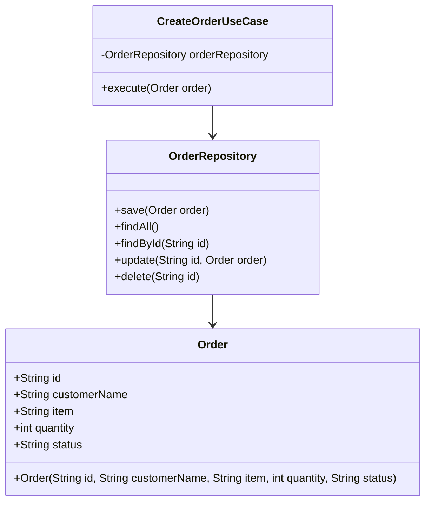

### Fase 3: Implementación de APIs (Archivo 6)

#### **Objetivo:**
Desarrollar una API RESTful funcional con operaciones CRUD, integrando una base de datos y aplicando las mejores prácticas arquitectónicas, principios de Twelve-Factor App, DevOps, Clean Architecture y SOLID. Además, implementar CQRS con endpoints separados para escritura y lectura utilizando réplicas de PostgreSQL.

---

### **Estructura de Clean Architecture:**
1. **Capa de Dominio:**
   - Define entidades y reglas de negocio.
   - **Ejemplo:**
     ```javascript
     class Order {
         constructor(id, customerName, item, quantity, status) {
             this.id = id;
             this.customerName = customerName;
             this.item = item;
             this.quantity = quantity;
             this.status = status || 'PENDING';
         }
     }
     module.exports = Order;
     ```

2. **Capa de Aplicación:**
   - Implementa casos de uso.
   - **Ejemplo:**
     ```javascript
     class CreateOrderUseCase {
         constructor(orderRepository) {
             this.orderRepository = orderRepository;
         }

         async execute(orderData) {
             const newOrder = await this.orderRepository.save(orderData);
             return newOrder;
         }
     }
     module.exports = CreateOrderUseCase;
     ```

3. **Capa de Infraestructura:**
   - Interactúa con la base de datos y otros servicios externos.
   - **Ejemplo de Repositorio:**
     ```javascript
     const pool = require('../config/db');

     class OrderRepository {
         async save(order) {
             const result = await pool.query(
                 'INSERT INTO orders (customer_name, item, quantity, status) VALUES ($1, $2, $3, $4) RETURNING *',
                 [order.customerName, order.item, order.quantity, order.status]
             );
             return result.rows[0];
         }

         async findAll() {
             const result = await pool.query('SELECT * FROM orders');
             return result.rows;
         }

         async findById(orderId) {
             const result = await pool.query('SELECT * FROM orders WHERE id = $1', [orderId]);
             return result.rows[0];
         }

         async update(orderId, orderData) {
             const result = await pool.query(
                 'UPDATE orders SET customer_name = $1, item = $2, quantity = $3, status = $4 WHERE id = $5 RETURNING *',
                 [orderData.customerName, orderData.item, orderData.quantity, orderData.status, orderId]
             );
             return result.rows[0];
         }

         async delete(orderId) {
             await pool.query('DELETE FROM orders WHERE id = $1', [orderId]);
         }
     }
     module.exports = OrderRepository;
     ```

4. **Capa de Presentación:**
   - Define los controladores y endpoints REST.
   - **Ejemplo de Controlador con CRUD y CQRS:**
     ```javascript
     const express = require('express');
     const Order = require('../domain/Order');
     const OrderRepository = require('../infrastructure/OrderRepository');
     const CreateOrderUseCase = require('../application/CreateOrderUseCase');

     const router = express.Router();
     const orderRepository = new OrderRepository();

     // CRUD Endpoints
     router.get('/orders', async (req, res) => {
         try {
             const orders = await orderRepository.findAll();
             res.json(orders);
         } catch (err) {
             res.status(500).send(err.message);
         }
     });

     router.get('/orders/:id', async (req, res) => {
         try {
             const order = await orderRepository.findById(req.params.id);
             if (!order) {
                 return res.status(404).json({ message: 'Order not found' });
             }
             res.json(order);
         } catch (err) {
             res.status(500).send(err.message);
         }
     });

     router.post('/orders', async (req, res) => {
         try {
             const { customerName, item, quantity } = req.body;
             const createOrder = new CreateOrderUseCase(orderRepository);
             const newOrder = await createOrder.execute(new Order(null, customerName, item, quantity));
             res.status(201).json(newOrder);
         } catch (err) {
             res.status(500).send(err.message);
         }
     });

     router.put('/orders/:id', async (req, res) => {
         try {
             const updatedOrder = await orderRepository.update(req.params.id, req.body);
             if (!updatedOrder) {
                 return res.status(404).json({ message: 'Order not found' });
             }
             res.json(updatedOrder);
         } catch (err) {
             res.status(500).send(err.message);
         }
     });

     router.delete('/orders/:id', async (req, res) => {
         try {
             await orderRepository.delete(req.params.id);
             res.status(204).send();
         } catch (err) {
             res.status(500).send(err.message);
         }
     });

     // CQRS Endpoints
     router.post('/commands/orders', async (req, res) => {
         try {
             const { customerName, item, quantity } = req.body;
             const createOrder = new CreateOrderUseCase(orderRepository);
             const newOrder = await createOrder.execute(new Order(null, customerName, item, quantity));
             res.status(201).json(newOrder);
         } catch (err) {
             res.status(500).send(err.message);
         }
     });

     router.get('/queries/orders', async (req, res) => {
         try {
             const orders = await orderRepository.findAll();
             res.json(orders);
         } catch (err) {
             res.status(500).send(err.message);
         }
     });

     module.exports = router;
     ```

---

### **Archivos de Configuración**

#### `config/db.js`
```javascript
const { Pool } = require('pg');
require('dotenv').config();

const pool = new Pool({
    connectionString: process.env.DATABASE_URL,
    ssl: {
        rejectUnauthorized: false,
    },
});

module.exports = pool;
```

#### `config/index.js`
```javascript
require('dotenv').config();

module.exports = {
    app: {
        port: process.env.PORT || 3000,
    },
    db: {
        url: process.env.DATABASE_URL,
    },
    jwt: {
        secret: process.env.JWT_SECRET,
    },
};
```

#### `config/logger.js`
```javascript
const winston = require('winston');

const logger = winston.createLogger({
    level: 'info',
    format: winston.format.json(),
    transports: [
        new winston.transports.Console(),
        new winston.transports.File({ filename: 'error.log', level: 'error' }),
    ],
});

module.exports = logger;
```

---

### **Estructura de Carpetas del Proyecto**
```
project-root/
├── domain/
│   └── Order.js
├── application/
│   └── CreateOrderUseCase.js
├── infrastructure/
│   └── OrderRepository.js
├── presentation/
│   ├── routes.js
│   └── swagger.js
├── config/
│   ├── index.js
│   ├── logger.js
│   └── db.js
├── scripts/
│   └── setup.sql
├── tests/
│   ├── usecase.test.js
│   └── repository.test.js
├── .env
├── .gitignore
└── package.json
```

---

### **Diagrama de Clases en Mermaid**


---

### **Pruebas Unitarias**

#### Archivo: `tests/repository.test.js`
```javascript
const OrderRepository = require('../infrastructure/OrderRepository');

jest.mock('../config/db', () => ({
    query: jest.fn(),
}));

const mockDb = require('../config/db');

describe('OrderRepository', () => {
    const repo = new OrderRepository();

    it('should save an order', async () => {
        mockDb.query.mockResolvedValueOnce({
            rows: [{ id: 1, customer_name: 'John Doe', item: 'Laptop', quantity: 1, status: 'PENDING' }],
        });

        const result = await repo.save({ customerName: 'John Doe', item: 'Laptop', quantity: 1, status: 'PENDING' });
        expect(result).toEqual({ id: 1, customer_name: 'John Doe', item: 'Laptop', quantity: 1, status: 'PENDING' });
        expect(mockDb.query).toHaveBeenCalledTimes(1);
    });

    it('should fetch all orders', async () => {
        mockDb.query.mockResolvedValueOnce({
            rows: [
                { id: 1, customer_name: 'John Doe', item: 'Laptop', quantity: 1, status: 'PENDING' },
            ],
        });

        const result = await repo.findAll();
        expect(result).toEqual([
            { id: 1, customer_name: 'John Doe', item: 'Laptop', quantity: 1, status: 'PENDING' },
        ]);
        expect(mockDb.query).toHaveBeenCalledTimes(1);
    });
});
```

---

### **Logs y Seguridad:**
1. **Logs Estructurados:**
   - Configurar Winston para manejar logs estructurados.
   - Ejemplo de configuración básica:
     ```javascript
     const logger = require('../config/logger');

     router.get('/orders', async (req, res) => {
         try {
             const orders = await orderRepository.findAll();
             res.json(orders);
             logger.info('Fetched all orders');
         } catch (err) {
             logger.error(err.message);
             res.status(500).send(err.message);
         }
     });
     ```

2. **Seguridad:**
   - **Autenticación:**
     - Implementar middleware de autenticación con JWT.
     ```javascript
     const jwt = require('jsonwebtoken');

     const authenticate = (req, res, next) => {
         const token = req.header('Authorization');
         if (!token) return res.status(401).send('Access Denied');

         try {
             const verified = jwt.verify(token, process.env.JWT_SECRET);
             req.user = verified;
             next();
         } catch (err) {
             res.status(400).send('Invalid Token');
         }
     };

     module.exports = authenticate;
     ```
   - **Políticas de Seguridad:**
     - Usar Helmet para proteger contra vulnerabilidades comunes:
       ```javascript
       const helmet = require('helmet');
       app.use(helmet());
       ```
     - Validar entradas de usuario con librerías como Joi o express-validator.

---

### **Entregables:**
1. **API funcional con CRUD y endpoints adicionales para CQRS.**
2. **Base de datos PostgreSQL con replicación configurada.**
3. **Logs estructurados y gestionados con Winston.**
4. **Autenticación JWT y middleware de seguridad.**
5. **Documentación Swagger para los endpoints.**
6. **Pruebas unitarias con Jest y logs estructurados.**
7. **Pipeline CI/CD configurado con GitHub Actions.**
8. **Monitoreo de métricas clave con Grafana.**
9. **Guía de despliegue para Kubernetes.**

