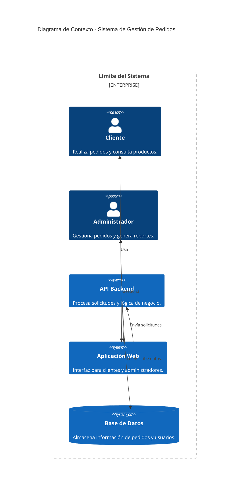

### Proyecto de Referencia: Sistema de Gestión de Pedidos para una Tienda en Línea

**Descripción General:**
Un sistema que permite a una tienda en línea gestionar pedidos, registrar órdenes y generar reportes, con un frontend para clientes, un backend con APIs RESTful, y despliegue en la nube utilizando Docker, Kubernetes y CI/CD.

---

### **Fase 1: Modelado del Negocio**

#### **Objetivo:**
Definir el modelo de negocio utilizando **Lean Canvas** y **Value Proposition Canvas**.

#### **Paso a Paso:**
1. **Identificar Problemas Clave:**
   - Ejemplo: “La gestión manual de pedidos provoca errores en los tiempos de entrega.”
2. **Definir Propuesta de Valor:**
   - Ejemplo: “Automatizar la creación y seguimiento de pedidos para reducir errores y mejorar tiempos.”
3. **Segmentar Clientes:**
   - Ejemplo: Tiendas pequeñas y medianas sin sistemas automatizados.
4. **Establecer Canales de Distribución:**
   - Ejemplo: Aplicación web y móvil.

#### **Plantilla de Lean Canvas:**
- **Problema:** Gestión manual de pedidos y estados.
- **Clientes:** Tiendas minoristas y negocios de comercio electrónico.
- **Propuesta de Valor:** Automatización de pedidos y seguimiento.
- **Canales:** Web, móvil y APIs para integraciones.
- **Estructura de Costos:** Desarrollo y despliegue en la nube.
- **Flujo de Ingresos:** Modelo SaaS con niveles de precios según uso.

#### **Entregables:**
- Lean Canvas completo.
- Documento de requisitos iniciales.
- Análisis de trade-offs de tecnologías (ejemplo: monolito vs microservicios).
- Identificación inicial de métricas operativas como SLO/SLA/SLI.

---

### **Fase 2: Diseño de Arquitectura**

#### **Objetivo:**
Diseñar la arquitectura del sistema usando **Clean Architecture** y el modelo **C4**.

#### **Paso a Paso:**
1. **Diagrama de Contexto (Nivel 1 - C4):**
   - Identificar actores principales: Cliente, Administrador, API Backend.
   - Representar interacciones generales.
2. **Dividir en Capas:**
   - **Dominio:** Reglas de negocio.
   - **Aplicación:** Casos de uso (CRUD de pedidos y reportes).
   - **Infraestructura:** Controladores, repositorios, conexiones a bases de datos.
3. **Incorporar Patrones de Diseño:**
   - Ejemplo: Repository para acceso a datos y CQRS para separar lecturas y escrituras.
4. **Evaluar Resiliencia y Fallos:**
   - Incorporar patrones como Circuit Breaker y Retry Mechanism.
5. **Definir Métricas Operativas y QoS:**
   - Ejemplo: Disponibilidad de API (99.9%) y latencia promedio (<200ms).

#### **Plantilla C4 (Nivel 1):**


#### **Entregables:**
- Diagramas C4 (Nivel 1 y Nivel 2).
- Documentación de decisiones arquitectónicas (ADR).
- Lista de trade-offs y justificación.
- Métricas operativas iniciales.

---

### **Fase 3: Implementación de APIs**

#### **Objetivo:**
Desarrollar una API RESTful funcional con operaciones CRUD.

#### **Paso a Paso:**
1. **Diseñar un Endpoint:**
   - Ejemplo: `/api/orders`.
2. **Definir las Operaciones:**
   - **GET:** Obtener todos los pedidos.
   - **POST:** Crear un nuevo pedido.
   - **PUT:** Actualizar un pedido existente.
   - **DELETE:** Eliminar un pedido.
3. **Implementar Seguridad:**
   - Uso de JWT para autenticación.
4. **Pruebas:**
   - Probar con Postman.
   - Validar respuestas y errores.
5. **Monitoreo y Logs:**
   - Implementar logs estructurados para cada operación clave.

#### **Ejemplo de Código (Node.js):**
```javascript
const express = require('express');
const app = express();
app.use(express.json());

let orders = [];

app.get('/api/orders', (req, res) => res.json(orders));
app.post('/api/orders', (req, res) => {
    const order = req.body;
    orders.push(order);
    res.status(201).json(order);
});

app.listen(3000, () => console.log('API running on port 3000'));
```

#### **Entregables:**
- API funcional.
- Documentación con Swagger.
- Logs y métricas básicas de operación.

---

### **Fase 4: Despliegue e Integración Continua**

#### **Objetivo:**
Implementar CI/CD y desplegar el sistema usando Docker y Kubernetes.

#### **Paso a Paso:**
1. **Crear un Dockerfile:**
   - Configurar la aplicación para su contenerización.
   ```dockerfile
   FROM node:16-alpine
   WORKDIR /app
   COPY package*.json ./
   RUN npm install
   COPY . .
   CMD ["node", "app.js"]
   ```
2. **Configurar Kubernetes:**
   - Crear un archivo YAML para el despliegue.
   ```yaml
   apiVersion: apps/v1
   kind: Deployment
   metadata:
     name: orders-api
   spec:
     replicas: 2
     selector:
       matchLabels:
         app: orders-api
     template:
       metadata:
         labels:
           app: orders-api
       spec:
         containers:
         - name: orders-api
           image: orders-api:1.0
           ports:
           - containerPort: 3000
   ```
3. **Configurar Pipeline CI/CD:**
   - Utilizar GitHub Actions o GitLab.
   - Automatizar pruebas y despliegue.
4. **Incluir Monitoreo y Alertas:**
   - Integrar Prometheus y Grafana para supervisión.

#### **Entregables:**
- Contenedor Docker funcional.
- Sistema desplegado en Kubernetes.
- Pipeline CI/CD operativo.
- Monitoreo básico con métricas y alertas.

---

### **Resultados Esperados**
- **Prototipo Final:** Sistema de gestión de pedidos desplegado y operando.
- **Documentación Completa:** Diagramas, decisiones técnicas y métricas de desempeño.
- **Métricas Operativas:** SLA del 99.9%, latencia promedio de <200ms, logs estructurados.

---

### **Nuevos Aspectos Considerados**
1. **Resiliencia:**
   - Circuit Breaker y patrones de Retry para garantizar alta disponibilidad.
2. **Trade-offs:**
   - Justificación detallada entre enfoques monolíticos y microservicios.
3. **Métricas Operativas:**
   - Implementación de SLI, SLO y SLA desde el diseño inicial.
4. **Observabilidad:**
   - Logs estructurados y monitoreo de métricas clave con herramientas como Prometheus y Grafana.
5. **Diseño para el Cambio:**
   - Modularidad que permite escalar o modificar fácilmente componentes específicos.

Con estas mejoras, el proyecto cubre no solo las bases técnicas, sino también los aspectos estratégicos y operativos necesarios para sistemas modernos.

