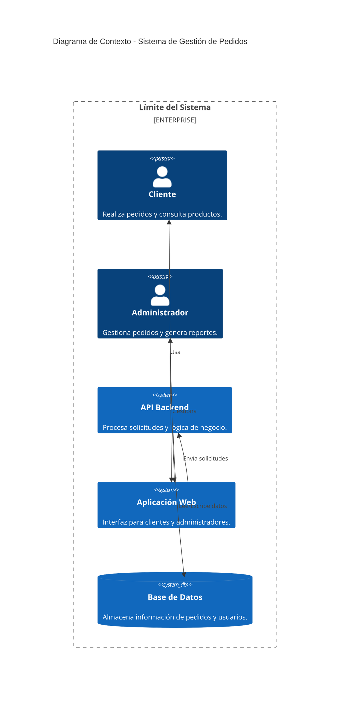
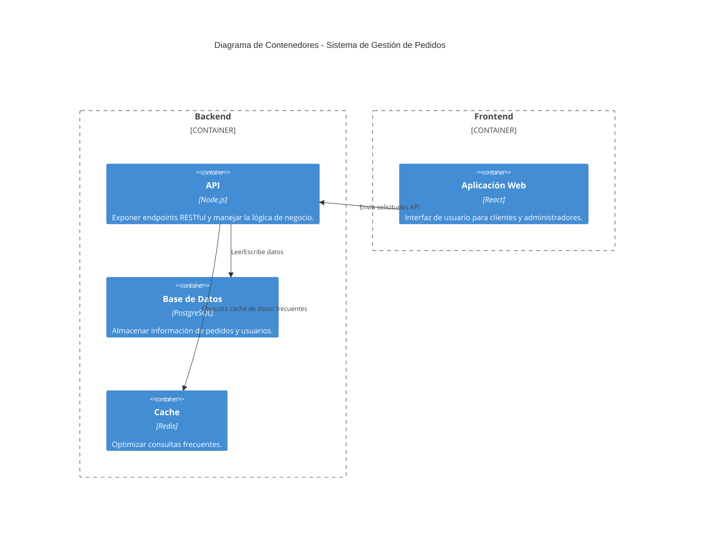

### RFC: Sistema de Gestión de Pedidos

#### **Introducción:**
Este documento de RFC (Request for Comments) describe la arquitectura propuesta para un sistema de gestión de pedidos robusto y escalable. El objetivo es documentar las decisiones técnicas, los problemas abordados, y cómo estas decisiones están alineadas con los requisitos funcionales y no funcionales definidos.

---

### **1. Problema**
La gestión manual de pedidos en organizaciones pequeñas y medianas provoca:
- Errores en los datos de pedidos.
- Retrasos en la ejecución y confirmación.
- Ausencia de un sistema centralizado que permita realizar reportes y análisis.

#### **Objetivo:**
Implementar un sistema automatizado que permita:
1. Crear, leer, actualizar y eliminar pedidos.
2. Gestionar usuarios (clientes y administradores).
3. Generar reportes en tiempo real con alta disponibilidad.

---

### **2. Requerimientos**

#### **2.1 Requerimientos Funcionales:**
- CRUD de pedidos.
- Capacidad para gestionar diferentes estados de pedidos.
- Gestión de roles: cliente y administrador.
- Generación de reportes personalizados.

#### **2.2 Requerimientos No Funcionales:**
- **Disponibilidad:** 99.9% SLA.
- **Escalabilidad:** Capacidad para manejar 1000 RPS (Requests per Second).
- **Latencia:** Respuesta promedio menor a 200ms.
- **Seguridad:** Autenticación basada en JWT y encriptación de datos sensibles.
- **Monitorización:** Visualización de métricas clave (Prometheus/Grafana).

---

### **3. Decisiones Técnicas**

#### **3.1 Arquitectura del Sistema:**
- **Patrón:** Clean Architecture.
- **Modelo de despliegue:** Kubernetes para orquestación de contenedores.
- **Infraestructura como Código (IaC):** Terraform para automatizar la infraestructura.
- **Gestón de secretos:** HashiCorp Vault para almacenar configuraciones sensibles.

#### **3.2 Base de Datos:**
- PostgreSQL con soporte para replicación y particionamiento.
- Implementación de CQRS (Command Query Responsibility Segregation) para mejorar rendimiento en operaciones masivas.

#### **3.3 CI/CD:**
- GitHub Actions para la automatización de pipelines.
- ArgoCD como herramienta GitOps para sincronización de manifiestos de Kubernetes.

#### **3.4 Monitorización:**
- **Prometheus:** Recolección de métricas del sistema.
- **Grafana:** Visualización y paneles personalizados para las métricas clave.

---

### **4. Diseño de la Solución**

#### **4.1 Diagrama de Contexto (Nivel 1 - C4):**

#### **4.2 División por Capas:**
- **Capa de Dominio:** Reglas de negocio puras (validación de pedidos, estados permitidos).
- **Capa de Aplicación:** Casos de uso que orquestan la comunicación entre las capas.
- **Capa de Infraestructura:** Repositorios, controladores, configuraciones externas y servicios.

#### **4.3 Diagrama de Contenedores (Nivel 2 - C4):**

---

### **5. Justificación de Decisiones**

#### **5.1 Patrones de Diseño:**
- Clean Architecture asegura modularidad y facilita pruebas unitarias.
- CQRS mejora el rendimiento al separar lecturas y escrituras.

#### **5.2 Infraestructura:**
- Kubernetes permite alta disponibilidad y escalabilidad.
- Vault asegura que las configuraciones sensibles estén protegidas.

#### **5.3 Herramientas de Monitorización:**
- Prometheus recolecta datos clave para identificar cuellos de botella.
- Grafana facilita la visualización y el análisis de métricas.

---

### **6. Métricas Operativas**
- **Disponibilidad:** >= 99.9% SLA.
- **Latencia Promedio:** <= 200ms por petición.
- **Errores Permitidos:** <= 1% de fallos por minuto.
- **Tiempo de Recuperación:** <= 5 minutos en caso de fallo crítico.

---

### **7. Plan de Implementación**

1. **Fase Inicial:**
   - Configuración de infraestructura con Terraform.
   - Despliegue de Kubernetes y configuración de Vault.

2. **Fase Intermedia:**
   - Desarrollo e integración de la API backend.
   - Creación de Helm Charts para el despliegue.

3. **Fase Final:**
   - Configurar Prometheus y Grafana para monitorización.
   - Validación de SLA y pruebas de carga.

---

### **Conclusión**
Este RFC define un enfoque estructurado para implementar un sistema de gestión de pedidos. Cada decisión técnica está fundamentada en los requisitos funcionales y no funcionales, asegurando una solución robusta, escalable y alineada con las mejores prácticas de la industria.

