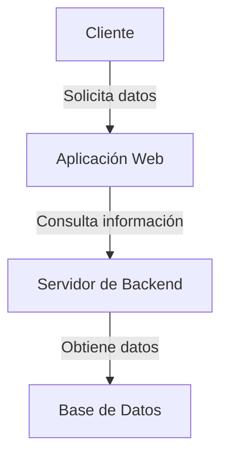

### Tema 1: Introducción a la Arquitectura de Software

#### **Objetivo del Tema**
Proveer una comprensión clara de los conceptos fundamentales de la arquitectura de software, destacando su importancia, niveles y modelos más comunes en la industria. Este tema sirve como base para abordar los conceptos más avanzados en diseño e implementación de sistemas distribuidos y escalables.

---

### **1. ¿Qué es la Arquitectura de Software?**
- **Definición:**
  La arquitectura de software es el conjunto de estructuras necesarias para razonar sobre el software, compuestas por elementos de software, relaciones entre ellos y propiedades de ambos. La arquitectura no solo define los componentes de un sistema, sino también las interacciones y las restricciones entre ellos. También actúa como una hoja de ruta para guiar a los equipos durante el ciclo de vida del desarrollo del software.

- **Propósito:**
  - Garantizar que un sistema sea escalable, resiliente, seguro y mantenible.
  - Servir como una herramienta de comunicación entre las partes interesadas (desarrolladores, gerentes, clientes).
  - Facilitar la toma de decisiones técnicas en función de los requisitos del negocio.
  - Proveer una base para gestionar la complejidad de los sistemas.

**Ejemplo Práctico:**
Un sistema de gestión de pedidos que escala desde decenas a millones de transacciones requiere una arquitectura clara para asegurar rendimiento y mantener la calidad del servicio.

### Ejemplo Visual
**Diagrama C4 (Nivel de Contexto):**

**Propósito Ampliado con Ejemplos:**
1. **Escalabilidad:** 
   - Caso: Un sistema de redes sociales necesita manejar un aumento masivo en usuarios durante un evento viral. Implementar balanceadores de carga y escalado automático permite soportar la demanda.
   - Resultado: Los usuarios tienen acceso sin interrupciones, incluso en picos de carga.

2. **Resiliencia:**
   - Caso: Un sistema de banca en línea aplica el patrón Circuit Breaker para evitar sobrecargar un servicio de pagos externo defectuoso.
   - Resultado: Las transacciones no críticas se completan, mientras el servicio afectado se recupera.

3. **Seguridad:**
   - Caso: Una API de comercio electrónico usa OAuth2 para autenticar a los usuarios y restringir el acceso a recursos específicos.
   - Resultado: Solo usuarios válidos acceden a datos sensibles, minimizando riesgos.

4. **Mantenibilidad:**
   - Caso: Una aplicación modular separa la lógica de negocio y la lógica de presentación, permitiendo actualizar la interfaz sin afectar el backend.
   - Resultado: Las actualizaciones son rápidas y con mínimo riesgo.

---

### **2. Importancia de la Arquitectura de Software**

#### **2.1 Impacto en el éxito del sistema:**
- Diseños arquitectónicos deficientes pueden generar problemas como:
  - **Deuda Técnica:** Soluciones improvisadas que aumentan la complejidad a largo plazo.
  - **Altos Costos de Mantenimiento:** Dificultad para realizar cambios o integrar nuevas funcionalidades.
  - **Pobre Experiencia del Usuario:** Problemas de rendimiento y latencia.

#### **2.2 Beneficios de una buena arquitectura:**
1. **Escalabilidad:**
   - Permite manejar una mayor carga de usuarios y transacciones.
   - **Ejemplo:** Una plataforma de streaming de video como Netflix escala servicios de reproducción en función de la región del usuario.

2. **Flexibilidad:**
   - Facilita agregar nuevas funcionalidades sin afectar los componentes existentes.
   - **Ejemplo:** Un sistema ERP modular permite añadir un módulo de contabilidad sin cambiar los módulos de inventario y facturación.

3. **Eficiencia:**
   - Optimiza el uso de recursos.     
   - **Ejemplo:** Implementar caché con Redis para consultas repetitivas reduce la carga en la base de datos principal.

4. **Calidad:**
   - Asegura que el sistema cumpla con requisitos como seguridad, confiabilidad y mantenibilidad.
   - **Ejemplo:** Una aplicación móvil aplica pruebas automatizadas en su pipeline CI/CD para garantizar la calidad antes del despliegue.

---

### **3. Roles y Responsabilidades de un Arquitecto de Software**

Un arquitecto de software juega un rol clave en el ciclo de vida del desarrollo de software. Sus principales responsabilidades incluyen:

#### **3.1 Diseño y Decisiones Arquitectónicas:**
- Diseñar la arquitectura basada en requisitos funcionales y no funcionales.
- Seleccionar tecnologías y herramientas apropiadas.
- Documentar las decisiones arquitectónicas mediante ADRs (Architecture Decision Records).

**Ejemplo:**
- Decisión: Uso de Kafka como sistema de mensajería para eventos debido a su capacidad de manejar grandes volúmenes de datos.
- Justificación: Garantiza escalabilidad y procesamiento en tiempo real.

#### **3.2 Comunicación:**
- Comunicar las decisiones arquitectónicas al equipo técnico y stakeholders.
- Servir de enlace entre equipos de negocio y desarrollo.

**Ejemplo:**
- Crear diagramas C4 para simplificar la comprensión de la arquitectura por parte de equipos no técnicos.

#### **3.3 Evaluación y Control:**
- Garantizar que las implementaciones cumplan con el diseño establecido.
- Identificar riesgos técnicos y proponer mitigaciones.

**Ejemplo:**
- Detectar un cuello de botella en el servicio de autenticación y optimizarlo antes del despliegue.

---

### **4. Niveles de Arquitectura**
1. **Arquitectura Empresarial:**
   - Se enfoca en la visión global de la organización, alineando los sistemas de software con los objetivos del negocio.
   - **Ejemplo:** Una empresa adopta TOGAF para unificar procesos de TI y negocio.

2. **Arquitectura de Solución:**
   - Diseña sistemas específicos para resolver problemas concretos de negocio.
   - **Ejemplo:** Un marketplace de comida implementa un sistema para gestionar entregas en tiempo real.

3. **Arquitectura Técnica:**
   - Detalla los componentes técnicos, las tecnologías utilizadas y los patrones de implementación.
   - **Ejemplo:** Uso de contenedores Docker y Kubernetes para orquestar microservicios.

---

### **5. Modelos de Arquitectura Comunes**

#### **5.1 Arquitectura Monolítica:**
- Toda la funcionalidad del sistema está empaquetada en una única aplicación.
- **Ventajas:**
  - Simplicidad en el desarrollo e implementación.
  - Menores costos iniciales.
- **Desventajas:**
  - Difícil de escalar.
  - Cambios pueden afectar toda la aplicación.

**Ejemplo:** Una tienda en línea simple que gestiona inventarios, pagos y usuarios en una única aplicación.

#### **5.2 Arquitectura de Microservicios:**
- Divide la funcionalidad en servicios pequeños y desacoplados que se comunican entre sí.
- **Ventajas:**
  - Escalabilidad independiente.
  - Facilita el despliegue continuo.
- **Desventajas:**
  - Complejidad en la comunicación y monitorización.

**Ejemplo:** Una plataforma de reserva de vuelos donde el servicio de precios y el de disponibilidad funcionan de forma independiente.

#### **5.3 Arquitectura Orientada a Eventos (Event-Driven):**
- Basada en la generación y procesamiento de eventos para comunicar componentes.
- **Ventajas:**
  - Alta escalabilidad y flexibilidad.
  - Facilita la integración de nuevos componentes.

**Ejemplo:** Un sistema de notificaciones push que procesa eventos generados por actividades de usuarios.

---

### **6. Ejercicios Prácticos**
1. **Mapear Niveles de Arquitectura:**
   - Crear un diagrama que represente los niveles de arquitectura para un sistema de gestión de inventarios.

2. **Elegir un Modelo Arquitectónico:**
   - Diseñar una solución para un marketplace y justificar el modelo seleccionado (Monolito, Microservicios, Event-Driven).

3. **Caso de Estudio:**
   - Analizar la arquitectura de Netflix y cómo sus microservicios gestionan el streaming de video.

4. **Implementar un Patrón:**
   - Proponer una arquitectura basada en eventos para un sistema de notificación.

---

### **7. Referencias y Recursos**
1. **Libros:**
   - "Software Architecture in Practice" - Bass, Clements, Kazman.
   - "Building Microservices" - Sam Newman.
   - "Designing Data-Intensive Applications" - Martin Kleppmann.
2. **Artículos y Blogs:**
   - [Martin Fowler - Arquitectura](https://martinfowler.com/architecture/).
   - [Fundamentos de Arquitectura](https://docs.microsoft.com/en-us/azure/architecture/).
   - [Patterns in Microservices](https://microservices.io/).
3. **Cursos:**
   - [Coursera: Software Architecture](https://www.coursera.org/specializations/software-design-architecture).
   - [Pluralsight: Software Architecture Fundamentals](https://www.pluralsight.com/).
4. **Videos:**
   - [Grokking System Design Interview](https://www.youtube.com/watch?v=xpDnVSmNFX0).
   - [Introduction to Microservices](https://www.youtube.com/watch?v=CZ3wIuvmHeM).

---

Esta introducción establece los fundamentos necesarios para abordar los temas avanzados del curso, proporcionando una base teórica sólida y ejemplos prácticos para cimentar el conocimiento.

