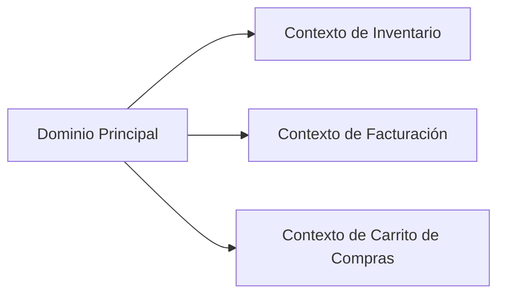
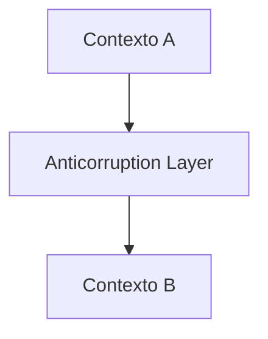
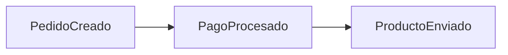

### Tema 3.1: Introducción a Domain-Driven Design (DDD)

#### **Introducción**
Domain-Driven Design (DDD) es una filosofía y un conjunto de patrones y prácticas diseñadas para ayudar a los equipos de desarrollo a construir sistemas complejos mediante un enfoque basado en el dominio del negocio. Introducido por Eric Evans en su libro "Domain-Driven Design: Tackling Complexity in the Heart of Software", DDD enfatiza la importancia de unificar los términos y el lenguaje del negocio con los modelos de software para lograr un desarrollo ágil y efectivo.

---

### **1. Principios Fundamentales de DDD**

#### **1.1 Dominio**
- **Definición:** El área principal de conocimiento o actividad que aborda el software.
- **Ejemplo:** En un sistema bancario, el dominio incluye conceptos como cuentas, transacciones y clientes.

#### **1.2 Modelo de Dominio**
- **Definición:** Una abstracción del dominio que describe sus conceptos principales, relaciones y reglas de negocio.
- **Propósito:** Servir como una representación compartida entre los desarrolladores y los expertos del negocio.

#### **1.3 Lenguaje Ubicuo**
- **Definición:** Un lenguaje compartido y consistente utilizado por el equipo de desarrollo y los expertos del negocio.
- **Ejemplo:** Usar términos como "Cliente", "Pedido" y "Producto" de manera coherente en todos los documentos, códigos y reuniones.

#### **1.4 Bounded Contexts**
- **Definición:** Una delimitación lógica dentro del dominio donde un modelo tiene una definición clara y consistente.
- **Ejemplo:** En una plataforma de comercio electrónico, los contextos pueden incluir "Inventario", "Carrito de Compras" y "Facturación".

**Diagrama de Contextos:**


---

### **2. Patrones Estratégicos en DDD**

#### **2.1 Context Map**
- **Definición:** Un mapa que describe las relaciones entre los Bounded Contexts en un sistema.
- **Propósito:** Identificar cómo interactúan los diferentes contextos y definir las integraciones.

#### **2.2 Patrones de Integración**
- **Shared Kernel:** Compartir un subconjunto del modelo entre contextos.
- **Anticorruption Layer:** Crear una capa que traduzca y proteja un contexto del impacto de otro.
- **Conformist:** Adaptarse completamente a las reglas de otro contexto.

**Ejemplo Visual:**


---

### **3. Patrones Tácticos en DDD**

#### **3.1 Entidades**
- **Definición:** Objetos del dominio que tienen una identidad única y persisten en el tiempo.
- **Ejemplo:** En un sistema bancario, una "Cuenta" es una entidad.

```java
public class Cuenta {
    private final String id;
    private double saldo;

    public Cuenta(String id, double saldoInicial) {
        this.id = id;
        this.saldo = saldoInicial;
    }

    public void depositar(double cantidad) {
        this.saldo += cantidad;
    }

    public double getSaldo() {
        return saldo;
    }
}
```

#### **3.2 Value Objects**
- **Definición:** Objetos que representan un concepto y son definidos por sus propiedades, no por su identidad.
- **Ejemplo:** Una "Dirección" puede ser un objeto de valor.

```java
public class Direccion {
    private final String calle;
    private final String ciudad;

    public Direccion(String calle, String ciudad) {
        this.calle = calle;
        this.ciudad = ciudad;
    }

    // getters y otros métodos
}
```

#### **3.3 Agregados**
- **Definición:** Un grupo de Entidades y Value Objects que son tratados como una unidad.
- **Ejemplo:** Una "Orden" que contiene "Líneas de Orden" es un agregado.

```java
public class Orden {
    private final String id;
    private final List<LineaDeOrden> lineas;

    public Orden(String id) {
        this.id = id;
        this.lineas = new ArrayList<>();
    }

    public void agregarLinea(LineaDeOrden linea) {
        lineas.add(linea);
    }
}
```

#### **3.4 Repositorios**
- **Definición:** Encapsulan la lógica para acceder y persistir agregados.
- **Ejemplo:**
```java
public interface RepositorioOrden {
    Orden obtenerPorId(String id);
    void guardar(Orden orden);
}
```

---

### **4. Event Storming**
- **Definición:** Una técnica colaborativa para descubrir eventos de dominio y comprender el flujo del sistema.
- **Ejemplo:**
  - Eventos: "Pedido creado", "Pago procesado", "Producto enviado".

**Visualización:**


---

### **5. Ejemplo Completo: Sistema de Reservas**

#### **Dominio:** Sistema de reservas para un hotel.

1. **Entidades:**
   - Cliente
   - Reserva

2. **Value Objects:**
   - Fecha de reserva
   - Habitación

3. **Agregado:**
   - Reserva (contiene Fecha y Habitación).

4. **Eventos de Dominio:**
   - "Reserva creada"
   - "Reserva cancelada"

5. **Repositorio:**
   - `RepositorioReserva`

**Ejemplo en Código:**
```java
public class Reserva {
    private final String id;
    private final Cliente cliente;
    private final FechaReserva fechaReserva;

    public Reserva(String id, Cliente cliente, FechaReserva fechaReserva) {
        this.id = id;
        this.cliente = cliente;
        this.fechaReserva = fechaReserva;
    }

    public String getId() {
        return id;
    }

    public Cliente getCliente() {
        return cliente;
    }

    public FechaReserva getFechaReserva() {
        return fechaReserva;
    }
}
```

---

### **6. Ventajas de DDD**
1. **Alineación con el negocio:** Facilita la colaboración entre desarrolladores y expertos del dominio.
2. **Mantenibilidad:** Permite que el software evolucione junto con los requisitos del negocio.
3. **Escalabilidad:** Promueve divisiones claras dentro del sistema.

---

### **7. Referencias y Recursos**
1. "Domain-Driven Design: Tackling Complexity in the Heart of Software" - Eric Evans.
2. [DDD Community](https://dddcommunity.org/).
3. [Implementing Domain-Driven Design](https://www.oreilly.com/library/view/implementing-domain-driven-design/9780133039900/) - Vaughn Vernon.

---

// Implementación de un sistema de inventario utilizando Domain-Driven Design (DDD) en Java.

// Entidad: Producto
public class Producto {
    private final String id;
    private String nombre;
    private int stock;

    public Producto(String id, String nombre, int stockInicial) {
        this.id = id;
        this.nombre = nombre;
        this.stock = stockInicial;
    }

    public void incrementarStock(int cantidad) {
        this.stock += cantidad;
    }

    public void decrementarStock(int cantidad) {
        if (cantidad > this.stock) {
            throw new IllegalArgumentException("Stock insuficiente");
        }
        this.stock -= cantidad;
    }

    public String getId() {
        return id;
    }

    public String getNombre() {
        return nombre;
    }

    public int getStock() {
        return stock;
    }
}

// Value Object: Ubicación del producto
public class Ubicacion {
    private final String estante;
    private final int posicion;

    public Ubicacion(String estante, int posicion) {
        this.estante = estante;
        this.posicion = posicion;
    }

    public String getEstante() {
        return estante;
    }

    public int getPosicion() {
        return posicion;
    }
}

// Agregado: Inventario
public class Inventario {
    private final String id;
    private final Map<String, Producto> productos;

    public Inventario(String id) {
        this.id = id;
        this.productos = new HashMap<>();
    }

    public void agregarProducto(Producto producto) {
        productos.put(producto.getId(), producto);
    }

    public void removerProducto(String productoId) {
        productos.remove(productoId);
    }

    public Producto obtenerProducto(String productoId) {
        if (!productos.containsKey(productoId)) {
            throw new IllegalArgumentException("Producto no encontrado");
        }
        return productos.get(productoId);
    }

    public Map<String, Producto> listarProductos() {
        return Collections.unmodifiableMap(productos);
    }

    public String getId() {
        return id;
    }
}

// Repositorio: Repositorio de Inventario
public interface RepositorioInventario {
    Inventario obtenerPorId(String id);
    void guardar(Inventario inventario);
    void eliminar(String id);
}

// Evento de dominio: ProductoAgregado
public class ProductoAgregado {
    private final String productoId;
    private final int cantidad;

    public ProductoAgregado(String productoId, int cantidad) {
        this.productoId = productoId;
        this.cantidad = cantidad;
    }

    public String getProductoId() {
        return productoId;
    }

    public int getCantidad() {
        return cantidad;
    }
}

// Servicio de dominio
public class ServicioInventario {
    private final RepositorioInventario repositorio;

    public ServicioInventario(RepositorioInventario repositorio) {
        this.repositorio = repositorio;
    }

    public void agregarProducto(String inventarioId, Producto producto) {
        Inventario inventario = repositorio.obtenerPorId(inventarioId);
        inventario.agregarProducto(producto);
        repositorio.guardar(inventario);
    }

    public void decrementarStock(String inventarioId, String productoId, int cantidad) {
        Inventario inventario = repositorio.obtenerPorId(inventarioId);
        Producto producto = inventario.obtenerProducto(productoId);
        producto.decrementarStock(cantidad);
        repositorio.guardar(inventario);
    }
}

// Implementación de un repositorio en memoria
public class RepositorioInventarioEnMemoria implements RepositorioInventario {
    private final Map<String, Inventario> baseDatos = new HashMap<>();

    @Override
    public Inventario obtenerPorId(String id) {
        return baseDatos.get(id);
    }

    @Override
    public void guardar(Inventario inventario) {
        baseDatos.put(inventario.getId(), inventario);
    }

    @Override
    public void eliminar(String id) {
        baseDatos.remove(id);
    }
}

// Main para demostrar la funcionalidad
public class Main {
    public static void main(String[] args) {
        RepositorioInventario repositorio = new RepositorioInventarioEnMemoria();
        ServicioInventario servicio = new ServicioInventario(repositorio);

        // Crear inventario
        Inventario inventario = new Inventario("INV001");
        repositorio.guardar(inventario);

        // Agregar productos
        Producto producto1 = new Producto("P001", "Laptop", 10);
        Producto producto2 = new Producto("P002", "Mouse", 50);

        servicio.agregarProducto("INV001", producto1);
        servicio.agregarProducto("INV001", producto2);

        // Disminuir stock
        servicio.decrementarStock("INV001", "P001", 2);

        // Listar productos
        Inventario actualizado = repositorio.obtenerPorId("INV001");
        actualizado.listarProductos().forEach((id, producto) -> {
            System.out.println("Producto: " + producto.getNombre() + ", Stock: " + producto.getStock());
        });
    }
}

Este documento proporciona una guía completa sobre DDD, incluyendo definiciones detalladas, ejemplos prácticos y patrones para modelar dominios complejos.

